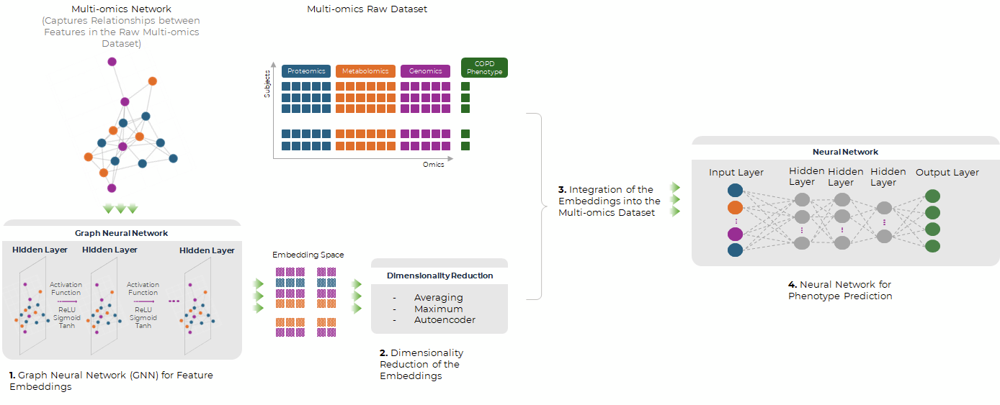
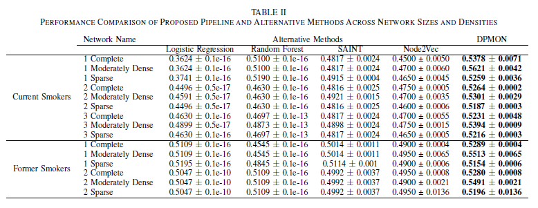
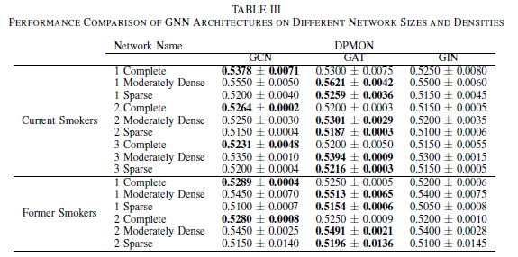

# Learning from Multi-omics Networks to Enhance Disease Prediction using Graph Neural Networks

<p align="center">
  This repository contains the code and supplementary material for the paper <strong>"Learning from Multi-omics Networks to Enhance Disease Prediction using Graph Neural Networks"</strong>, accepted at IEEE BIBM 2024. The paper will be published soon and added to this README.
</p>

---

# DPMON: Disease Prediction with Multi-Omics Networks

DPMON (Disease Prediction with Multi-Omics Networks) is a  **multi-omics integration pipeline** designed to enhance disease phenotype prediction through **Graph Neural Networks (GNNs)**. It addresses the complexities of multi-dimensional biological data by capturing intricate biomolecular interactions within a multi-omics network structure. DPMON leverages GNNs to generate informative node embeddings, integrating these embeddings with original subject-level data, thereby improving disease prediction accuracy. This pipeline is particularly effective for complex diseases like Chronic Obstructive Pulmonary Disease (COPD), as it captures both local and global dependencies, enhancing predictive insights.

## Table of Contents

- [Introduction](#introduction)
- [Dataset Description](#dataset-description)
- [Methodology](#methodology)
  - [1. Feature Embedding with Graph Neural Networks](#1-feature-embedding-with-graph-neural-networks)
  - [2. Dimensionality Reduction](#2-dimensionality-reduction)
  - [3. Integration of Multi-Omics Embeddings](#3-integration-of-multi-omics-embeddings)
  - [4. Neural Network for Phenotype Prediction](#4-neural-network-for-phenotype-prediction)
- [Baseline Models](#baseline-models)
  - [TabSurvey for Benchmarking](#tabsurvey-for-benchmarking)
- [Experimental Results](#experimental-results)
- [Installation](#installation)
  - [Setting Up a Virtual Environment](#setting-up-a-virtual-environment)
- [Usage](#usage)
  - [Running the Baseline Models](#running-the-baseline-models)
  - [Running DPMON with GNNs](#running-dpmon-with-gnns)
- [Performance Comparison](#performance-comparison)
- [Extending DPMON](#extending-dpmon)
- [License](#license)
- [Contact](#contact)
- [Getting Started](#getting-started)
- [Contributing](#contributing)
- [Acknowledgements](#acknowledgements)
- [References](#references)

## Introduction

Multi-omics data integration is pivotal for understanding complex biological systems and improving disease prediction models. Traditional methods often struggle with the high dimensionality and intricate interactions inherent in multi-omics datasets. DPMON addresses these challenges by employing Graph Neural Networks to capture and leverage the underlying network structures, resulting in more accurate and insightful disease predictions.

## Dataset Description

The datasets used in this study focus on Chronic Obstructive Pulmonary Disease (COPD) and are categorized based on smoking status and disease severity. Below are the key details of the datasets utilized:

### 1. **Patient Groups**

- **Current Smokers**: Individuals who are currently smoking.
- **Former Smokers**: Individuals who have quit smoking.

### 2. **Disease Severity**

- **GOLD Stage**: The severity of COPD is classified into six distinct classes based on the Global Initiative for Chronic Obstructive Lung Disease (GOLD) criteria. This classification helps in assessing the progression and severity of the disease.

### 3. **Network Types**

To capture the complexity of biological interactions, three types of network densities were considered:

- **Complete Networks**: Fully connected networks where every node is connected to every other node.
- **Moderately Dense Networks**: Networks with a balanced number of connections, representing realistic biological interactions without being overly sparse or dense.
- **Sparse Networks**: Networks with limited connections, highlighting the most critical interactions.

### 4. **Experimental Runs**

Given the variability in sample sizes and to ensure robust performance evaluation, multiple independent runs were conducted:

- **Former Smokers**: 1,000 runs to account for larger sample sizes.
- **Current Smokers**: 500 runs to accommodate smaller sample sizes.

### 5. **Data Integration**

The multi-omics data integrated includes various biological layers such as genomics, transcriptomics, proteomics, and metabolomics. Preprocessing steps involved normalization, feature selection, and handling missing data to ensure data quality and consistency across different omics layers.

### 6. **Data Sources**

Data was sourced from clinical studies and biobanks that collect comprehensive multi-omics profiles of COPD patients. Detailed information about data collection, inclusion criteria, and preprocessing protocols can be found in the supplementary materials of the associated paper.

*Note: Sensitive data and large datasets are excluded from this repository. Users aiming to replicate the results will need to obtain the necessary data from authorized sources and adjust the data paths accordingly.*

## Methodology

This repository contains the code for a multi-omics data integration pipeline that leverages graph neural networks for enhanced phenotype prediction. The pipeline consists of four main components:



### 1. Feature Embedding with Graph Neural Networks

We utilize Graph Neural Networks (GNNs) such as Graph Convolutional Networks (GCN) and Graph Attention Networks (GAT) to extract informative node embeddings from the biological interaction graphs. These embeddings capture the complex relationships and interactions between different biological entities, providing a rich feature representation for downstream tasks.

### 2. Dimensionality Reduction

To address computational inefficiencies and reduce the complexity of the embedding space, we apply dimensionality reduction techniques. Methods like Principal Component Analysis (PCA) or t-Distributed Stochastic Neighbor Embedding (t-SNE) are employed to lower the dimensionality while preserving the most significant features of the embeddings.

### 3. Integration of Multi-Omics Embeddings

The reduced embeddings are integrated with the raw multi-omics data using techniques such as concatenation or scaling. This integration ensures that both the network-derived features and the original subject-level omics data contribute to the phenotype prediction model, enhancing its robustness and accuracy.

### 4. Neural Network for Phenotype Prediction

A neural network is trained to predict disease phenotypes based on the integrated data. The entire pipeline is trained end-to-end, allowing for simultaneous optimization of all components. This holistic training approach ensures that each component synergistically contributes to the overall predictive performance.

## Baseline Models

The `/Baseline` directory contains alternative models for comparative analysis, including:

- **Logistic Regression**
- **Random Forest**
- **SAINT**

These baseline models serve as benchmarks, allowing us to evaluate DPMON's performance against traditional models. **Please note that using the baseline models is not necessary for running DPMON.** They are provided here as a reference for researchers who may wish to construct their own baselines or evaluate DPMON’s performance in a similar context.

### TabSurvey for Benchmarking

For constructing our baseline models, we leveraged the [TabSurvey repository](https://github.com/kathrinse/TabSurvey), which provides an open performance benchmark on tabular data, as described in the paper "Deep Neural Networks and Tabular Data: A Survey" (Borisov et al., IEEE TNNLS, 2022). Our modified version of TabSurvey, included in the `/Baseline/tabsurvey` directory, allows us to run specific baseline tests tailored to our study on multi-omics data. This benchmark repository facilitated a structured comparison of various tabular data models under a unified setup.

The scripts `testCurrent.sh` and `testFormer.sh` in `/Baseline/tabsurvey/` can be used to run SAINT for both current and former smoker datasets, respectively. Additionally, `baseline.sh` in the `/Baseline` directory will execute both pipelines and print a completion message once they’re done.

### Important Note on Data Access

Our `.gitignore` file restricts access to certain files and directories containing sensitive data or large datasets. Users attempting to replicate our results will need to replace data paths and files specific to our experiments. The baseline scripts, including `baseline.py` and `baseline.sh`, serve as examples for structuring and running baseline models, allowing others to construct and evaluate their own models on comparable datasets.

**Key data-related entries in `.gitignore` include**:

- `/Baseline/Output`: Directory for storing model outputs.
- `/tabsurvey/Results`: Directory for storing results from `TabSurvey`.
- Other paths related to experimental dataset files and cached files.

## Experimental Results

This section presents the experimental results evaluating the proposed multi-omics integration pipeline. We begin by comparing the predictive performance of our method against established baselines and alternative approaches. Subsequently, we conduct a thorough sensitivity analysis to assess the robustness of our pipeline and identify optimal parameter configurations. The results provide insights into the pipeline’s efficacy and its potential for application in various biological and clinical research scenarios.

### a) Performance Comparison

To evaluate the proposed pipeline, we compared its performance against several benchmark models and alternative methods across different network densities. Table II presents the accuracy scores for predicting the GOLD stage of COPD (6 classes) for both current and former smokers, considering three network types (complete, moderately dense, and sparse) for each of the two distinct patient groups. We conducted multiple independent runs for each network group. Specifically, we performed 1,000 runs for former smokers and 500 runs for current smokers, considering the differing sample sizes of these groups. Performance metrics were averaged across these runs to obtain reliable estimates.

- **Current Smokers**: Our proposed pipeline consistently outperformed all baseline models and the Node2Vec-based approach across all network types. Notably, the highest accuracy improvement was achieved in the moderately dense networks, where our pipeline’s accuracy was 56.21%, 53.01%, and 53.94%, respectively, representing an approximately 10% improvement over the best-performing comparative model.

- **Former Smokers**: Similarly, for the former smokers’ dataset, our pipeline showed superior performance compared to the baselines. The moderately dense network exhibited the highest accuracy at 55.13% and 54.91%, which is an approximate 8% increase over the best-performing baseline.



## Installation

1. **Clone the repository:**
    ```bash
    git clone https://github.com/bdlab-ucd/DPMON.git
    cd DPMON
    ```

2. **Install dependencies:**
    ```bash
    pip install -r requirements.txt
    ```

## Setting Up a Virtual Environment

DPMON requires **Python 3.9** or **3.10** to run properly, especially when using libraries like `ray`. For Windows users, it may be necessary to install `pyenv-win` to manage Python versions:

```bash
pip install pyenv-win==1.2.1
```
Once the correct Python version is set up, create a virtual environment to isolate the project dependencies:

```bash
pyenv exec python3.10 -m venv dpmon_env
source dpmon_env/bin/activate
#Windows: `source dpmon_env\Scripts\activate`
```

## Usage

### Running the Baseline Models

To execute the baseline models, navigate to the `/Baseline` directory. You can run the models individually or use the `test_run_all.sh` script to execute all benchmarks and tests at once.

1. **To run models individually:**

    - Run `baseline.py` for simpler baseline models (e.g., Logistic Regression, Random Forest) using:
        ```bash
        python baseline.py
        ```

   - Alternatively, to execute SAINT or other models for specific cohorts, use the following scripts:
        ```bash
        ./tabsurvey/testFormer.sh
        ./tabsurvey/testCurrent.sh
        ```

2. **To run all baseline tests and benchmarks at once:**

   Use the `test_run_all.sh` script, which will sequentially execute `testFormer.sh`, `testCurrent.sh`, and `baseline.py`:

    ```bash
    ./test_run_all.sh
    ```
This script runs all baseline tests and outputs a completion message when finish


## Running DPMON with GNNs

To run DPMON with GNNs, execute the main script in the `/DPMON` directory. Use the following command with customizable parameters:

```bash
python main.py --model <NameOfTheModel> --dataset <NameOfTheDataset> --lr <LearningRate> --weight-decay <WeightDecay> --layer_num <NumberOfLayers> --hidden_dim <EmbeddingDim> --epoch_num <NumberOfEpochs>
```

**Parameters**:

- `--model`: The GNN model to use (e.g., GCN, GAT, SAGE).
- `--dataset`: The graph dataset file (CSV of the adjacency matrix).
- `--lr`: Learning rate for the GNN (controls update frequency).
- `--weight_decay`: Regularization parameter for the GNN.
- `--layer_num`: Number of GNN layers, defining the neighborhood depth.
- `--hidden_dim:` Dimension of the embedding space.
- `--epoch_num`: Number of training epochs.

**Example command**:

```bash
python main.py --model GCN --dataset COPD_network.csv --lr 0.01 --weight-decay 1e-4 --layer_num 3 --hidden_dim 128 --epoch_num 50
```

## Performance Comparison

DPMON outperforms baseline models on various network configurations, including Complete, Moderately Dense, and Sparse networks for both Current Smokers and Former Smokers groups. Table III below summarizes performance metrics across methods:

<div align="center">
    
</div>

## Extending DPMON

DPMON is designed to be modular and extendable. To add new algorithms or modify existing components, refer to the `/DPMON` directory structure. Contributions that enhance DPMON’s functionality or integrate additional data sources are welcome.

## License

This project is licensed under the [MIT License](LICENSE).

## Contact

For inquiries, please contact:
- [Sundous Hussein](mailto:sundous.hussein@ucdenver.edu)
- [Vicente Ramos](mailto:vicente.ramos@ucdenver.edu)


## Getting Started

To get started with DPMON, follow the installation instructions above, set up your virtual environment, and explore the usage sections to run baseline models or DPMON with your own datasets. For further assistance or to contribute to the project, please reach out via the contact information provided.

## Contributing

We welcome contributions from the community! If you have suggestions, bug reports, or feature requests, please open an issue or submit a pull request on GitHub.

## Acknowledgements

We would like to thank... someone :D

## References

Link to paper
Link to other paper maybe? node2vec paper? :D
