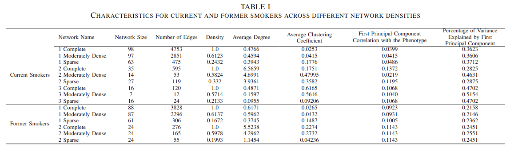
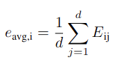
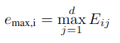

# <p align="center">Learning from Multi-Omics Networks to Enhance Disease Prediction: An Optimized Network Embedding and Fusion Approach</p>

<p align="center">
  This repository contains the code and supplementary material for the paper <strong>"Learning from Multi-omics Networks to Enhance Disease Prediction using Graph Neural Networks"</strong>, accepted at IEEE BIBM 2024. The paper will be published soon and added to this README.
</p>

---

DPMON (**D**isease **P**rediction
using **M**ulti-**O**mics **N**etworks), is a novel pipeline that leverages the power of Graph Neural Networks (GNNs) to 
capture intricate relationships between biological entities and extract valuable knowledge from this network structure. GNNs, 
unlike traditional methods like DeepWalk, LINE, or Node2Vec , which rely on random walks or edge sampling,
capture both local and global graph structure and directly incorporate node features alongside the network structure,
leading to a more informative and context-aware representation of the features. The generated representations are then
integrated with the original multi-omics data to enrich the subjects’ representation. This dataset is further processed through
a Neural Network (NN) component, specifically designed to predict the disease phenotype. Importantly, DPMON is
optimized end-to-end, i.e., all components, including the GNN and the subsequent NN, are trained simultaneously. This end-
to-end optimization ensures that the node embeddings are not just reflective of the network’s structure but are also tailored
to enhance the predictive power of the final model. Our work departs from the aforementioned traditional paradigm
by prioritizing the extraction of informative representations from the network itself, which are then integrated with patient-
level data to enhance predictive performance. By focusing on the intrinsic connectivity of the multi-omics networks,
rather than subject-specific variations, our method reduces the risk of overfitting to individual data points and improves the
generalizability of the model.
## Table of Contents

- [Dataset Description](#dataset-description)
- [Architecture](#architecture)
  - [1. Feature Embedding with Graph Neural Networks](#1-feature-embedding-with-graph-neural-networks)
  - [2. Dimensionality Reduction](#2-dimensionality-reduction)
  - [3. Integration of Multi-Omics Embeddings](#3-integration-of-multi-omics-embeddings)
  - [4. Neural Network for Phenotype Prediction](#4-neural-network-for-phenotype-prediction)
- [Experimental Results](#experimental-results)
- [Installation](#installation)
  - [Setting Up a Virtual Environment](#setting-up-a-virtual-environment)
- [Usage](#usage)
- [Performance Comparison](#performance-comparison)
- [Contact](#contact)
- [References](#references)


## Dataset Description

---
The COPDGene study is a multi-center observational study to identify the factors associated with COPD. The study recruited 
10,198 current and former smokers with at least a 10-pack-year history of smoking, as well as additional never-smoker 
controls (defined as having smoked fewer than 100 cigarettes in their lifetime) both with and without COPD. Genotyping 
data were from the enrollment visit and proteomics were generated at the five-year follow-up
(2013 to 2017). This rich multi-omics dataset serves as the foundation for our study.
To capture the complex interconnections between -omics, we constructed several networks using Sparse Generalized
Tensor Canonical Correlation Analysis Network Inference (SGTCCA-Net), a novel multi-omics network analysis
pipeline that accounts for higher-order correlations and can effectively overcome limitations with canonical correlation
when used to integrate one or two -omics types and a single trait of interest. These networks capture complex relationships
between various biological entities and clinical variables, providing a rich context for phenotype prediction. Importantly,
to maximize the effectiveness of graph neural networks, we incorporated detailed node features by carefully considering
correlations between -omics and clinical variables relevant to COPD. This meticulous feature selection process ensures
that GNNs can effectively leverage the rich and nuanced information embedded in the nodes, enhancing the model’s
ability to predict the phenotype accurately.

Additional details about the construction of the networks
can be found in [1] and [2]. All networks underwent varying
degrees of sparsification according to their edge weights,
resulting in fifteen networks with distinct density levels. Table
I provides a detailed overview of the characteristics of each
network employed in this study.
The datasets used in this study focus on Chronic Obstructive Pulmonary Disease (COPD) and are categorized based on smoking status and disease severity. Below are the key details of the datasets utilized:


## Architecture

---

Fig. 1 details our multi-omics data integration pipeline (DPMON) for improved phenotype prediction. This pipeline consists 
of four main components: **1)** a Graph Neural Network (GNN) for Feature Embeddings, **2)** Dimensionality Reduction of the 
Embeddings, **3)** Integration of Embeddings into the Multi-omics Dataset, and **4)** a Neural Network (NN) for 
Phenotype Prediction. The entire pipeline is trained end-to-end, ensuring joint optimization of the GNN and the NN parameters 
based on the prediction loss.


### 1. Feature Embedding with Graph Neural Networks

We employ GNNs to extract informative node repre-
sentations from the input network. GNNs are neural
networks that can effectively process graph-structured
data by iteratively aggregating and transforming infor-
mation from a node’s local neighborhood, allowing them
to capture both local and global structures in the graph.
They can model complex interactions and dependencies
between nodes, which are often critical in biological
networks where features are highly interconnected.
To generate node representations, weighted, non-
negative, undirected networks of p multi-omics repre-
sented using their adjacency matrix Ap × p are fed to a
GNN, the output of which is a matrix Ep × d of real-
valued dense vectors corresponding to each node in the
network, where d is the dimension of the embedding
space (an adjustable parameter of the pipeline). These
embeddings capture the structural and relational infor-
mation of the nodes, enhancing the representation of the
multi-omics features. This network represents features
(e.g., genes, proteins) as nodes and their relationships
as edges. The GNN iteratively aggregates information
from a node’s neighborhood, capturing the contextual
influence of connected features on the target node.
### 2. Dimensionality Reduction of the Embeddings

The extracted embeddings Ep × d are high-dimensional, poten-
tially leading to computational inefficiency. We address
this by applying dimensionality reduction techniques.
Three methods were evaluated:

* Averaging: Given the node embeddings matrix
Ep × d, the averaging method reduces the dimen-
sionality by calculating the average of the embed-
dings across all d dimensions for each node. This
results in a new matrix Eavg of size p × 1, where
each element represents the averaged embedding for
a particular node. For each node i, the averaged
embedding eavg,i can be computed as:
<div align="center">
    
</div>

* Maximum: This method selects the maximum value
across each dimension of the individual embed-
dings, resulting in a lower-dimensional matrix Emax
of size p × 1. For each node i, the maximum
embedding emax,i can be computed as:
<div align="center">
    
</div>

* Autoencoder: This more sophisticated method in-
volves training an autoencoder neural network to
learn a compressed representation of the node em-
beddings. The autoencoder consists of an encoder
that maps the high-dimensional embeddings to a
lower-dimensional space and a decoder that re-
constructs the original embeddings from this com-
pressed representation.
### 3. Integration of the Embeddings into the Multi-Omics Dataset

Following dimensionality reduction, the result-
ing embeddings are integrated with the multi-omics
data (e.g., gene expression, protein abundance). This
combined dataset leverages both the intrinsic feature
information and the contextual relationships captured by
the network to enhance the prediction capabilities of
the features. We experimented with different integration
techniques to determine the most effective approach for
our specific data and task. A straightforward approach is
to concatenate the embedding vectors with the original
multi-omics features, creating a new feature vector with
richer information. Alternatively, the embeddings can
be used to scale or weight the features in the data.
This approach assigns higher importance to features
deemed more informative based on their network context
captured by the embeddings. The selection criterion was
based on the method that yielded the highest prediction
accuracy.
### 4. Neural Network for Phenotype Prediction
The final component of the pipeline is a neural network architecture
designed for phenotype prediction. This network takes
the integrated multi-omics data, including the network-
derived embeddings, as input and learns a mapping
function to predict the desired phenotype. We employed
a feed-forward neural network with two hidden layers
of linear transformations interleaved with batch normal-
ization and ReLU activation functions. The output layer
employs a softmax activation function to produce class
probabilities for the disease prediction task.

## Experimental Results

---
To evaluate the proposed
pipeline, we compared its performance against several bench-
mark models and alternative methods across different network
densities. Table II presents the accuracy scores for predicting
the GOLD stage of COPD (6 classes) for both current and
former smokers, considering three network types (complete,
moderately dense, and sparse) for each of the two distinct
patient groups. We conducted multiple independent runs for
each network group. Specifically, we performed 1000 runs for
former smokers and 500 runs for former smokers, consider-
ing the differing sample sizes of these groups. Performance
metrics were averaged across these runs to obtain reliable
estimates.

* **Current Smokers:** Our proposed pipeline consistently
outperformed all baseline models and the Node2Vec-
based approach across all network types. Notably, the
highest accuracy improvement was achieved in the mod-
erately dense networks, where our pipeline’s accuracy
was 56.21%, 53.01%, and 53.94%, respectively, repre-
senting an approximately 10% improvement over the
best-performing comparative model.
* **Former Smokers:** Similarly, for the former smokers’
dataset, our pipeline showed superior performance com-
pared to the baselines. The moderately dense network
exhibited the highest accuracy at 55.13% and 54.91%,
which is an approximate 8% increase over the best-
performing baseline.

Our proposed pipeline consistently outperformed all base-
line models and the Node2Vec-based approach across all
network types and patient groups. Notably, the moderately
dense networks often yielded the highest accuracy, suggesting
that a balance between network connectivity and information
richness is crucial for optimal performance. While sparse
networks are computationally efficient and often capture the
most significant relationships, which can help the GNN focus
on the most relevant information and avoid overfitting, they
might miss some important relationships, which can reduce
the performance of the GNN if these relationships are crucial
for the prediction task. Complete networks on the other
hand capture all possible connections which can introduce
significant noise due to spurious correlations or redundant
information, making it harder for the GNN to learn useful
patterns.

<p align="center">
    
</p>


The architecture of the GNN plays
a crucial role in the performance of the pipeline. We
experimented with different types of GNNs, such as
Graph Convolutional Networks (GCNs), Graph At-
tention Networks (GATs), and Graph Isomorphism
Networks (GINs). Each architecture was evaluated
for its ability to capture complex relationships within
multi-omics networks. Based on this evaluation, we pro-
vide recommendations for selecting the most suitable
GNN architecture depending on the characteristics of the
network data and the prediction task. Table III offers a
comparative analysis of three GNN architectures (GCN,
GAT, and GIN) across various network densities and
sizes for two patient groups. The results demonstrate the
consistent superiority of GAT over GCN and GIN in
terms of prediction accuracy. Based on these experiments,
we draw the following conclusions:

* GAT Dominance: GAT consistently outperforms
GCN and GIN across all network conditions. This
suggests that the attention mechanism employed by
GAT effectively captures the complex relationships
within multi-omics networks, leading to improved
feature representation and predictive power. 
* Network Density Impact: While there is some
variation in performance across different network
densities, the overall trend indicates that moderately
dense networks tend to yield slightly better results
compared to complete or dense networks. This sug-
gests that a balance between network connectivity
and information richness is crucial for optimal per-
formance. 
* GIN Performance: GIN consistently demonstrates
lower accuracy compared to GCN and GAT. This
could be due to the increased complexity of the
model, leading to overfitting or difficulties in opti-
mization.
<div align="center">
    
</div>


## Installation

---
1. **Clone the repository:**
    ```bash
    git clone https://github.com/bdlab-ucd/DPMON.git
    cd DPMON
    ```

2. **Install dependencies:**
    ```bash
    pip install -r requirements.txt
    ```

## Setting Up a Virtual Environment

---
DPMON requires **Python 3.9** or **3.10** to run properly. For Windows users, it may be necessary to install `pyenv-win` to manage Python versions:

```bash
pip install pyenv-win==1.2.1
```
Once the correct Python version is set up, create a virtual environment to isolate the project dependencies:

```bash
pyenv exec python3.10 -m venv dpmon_env
source dpmon_env/bin/activate
#Windows: `source dpmon_env\Scripts\activate`
```

## Usage

---


1. Tune the Hyperparameters of the Pipeline: Use the following command to tune the parameters of the pipeline
components.

```bash
python main.py --gnn_model <GNNModel> --dataset_dir <DatasetDirectory> --tune 
```
**Parameters:**
* `--gnn_model`: The GNN model to use (e.g., GCN, GAT, SAGE, and GIN).
* `--dataset_dir`: The directory containing the multi-omics dataset and the associated networks.
* `--gpu`: Run on GPU.
2. Run DPMON: Execute the main.py script under /DPMON with the desired hyperparameters.

```bash
python main.py --gnn_ <GNNModel> --dataset_dir <DatasetDirectory> --lr <LearningRate> --weight-decay <WeightDecay> --layer_num <NumberOfLayers> --hidden_dim <EmbeddingDim> --epoch_num <NumberOfEpochs>
```

**Parameters**:

* `--gnn_model`: The GNN model to use (e.g., GCN, GAT, SAGE, and GIN).
* `--dataset_dir`: The directory containing the multi-omics dataset and the associated networks.
* `--gpu`: Run on GPU.

## Contact

For inquiries, please contact:
- [Sundous Hussein](mailto:sundous.hussein@ucdenver.edu)
- [Vicente Ramos](mailto:vicente.ramos@ucdenver.edu)


## References
**[1]** Liu, W. et al., “A Generalized higher-order correlation analysis frame-
work for multi-omics network inference,” bioRxiv [Preprint]. 2024
Jan 25:2024.01.22.576667. doi: 10.1101/2024.01.22.576667. PMID:
38328226; PMCID: PMC10849540.

**[2]** Konigsberg, I et al., “Proteomic networks and related genetic
variants associated with smoking and chronic obstructive pulmonary
disease,” medRxiv [Preprint]. 2024 Feb 28:2024.02.26.24303069.
doi: 10.1101/2024.02.26.24303069. PMID: 38464285; PMCID:
PMC10925350.

